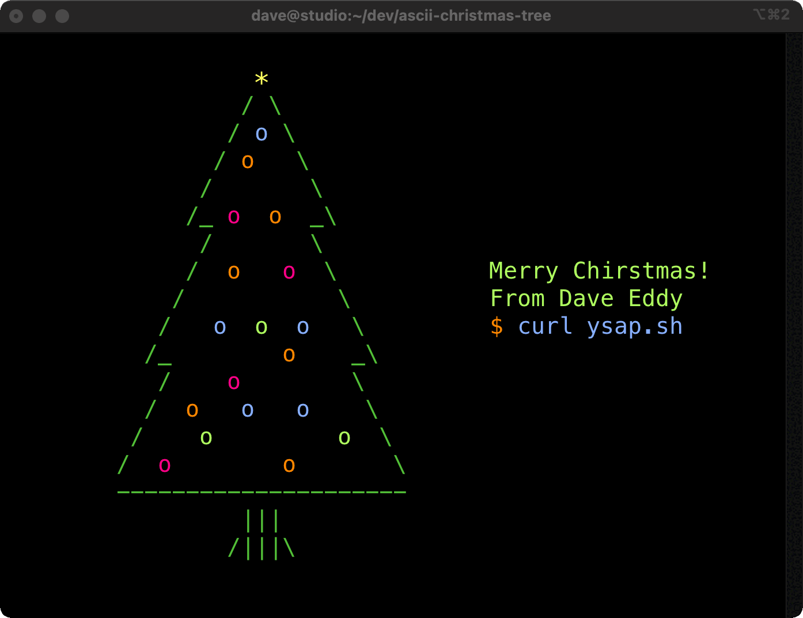

Bash ASCII Christmas Tree
=========================

Print a super fancy Christmas tree in your terminal WITH an animated light show!
Merry Christmas!



Usage
-----

Run it right now with `curl`:

```
curl xmas.ysap.sh | bash
```

Clone the repo and run it locally:

```
./ascii-christmas-tree
```

Example
-------

See how this program was written: https://www.youtube.com/watch?v=NENq-G2PsTo

License
-------

MIT License
